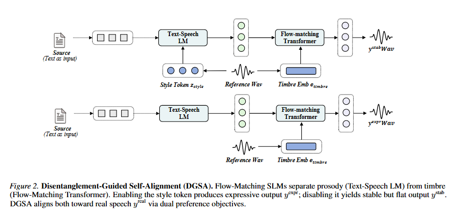
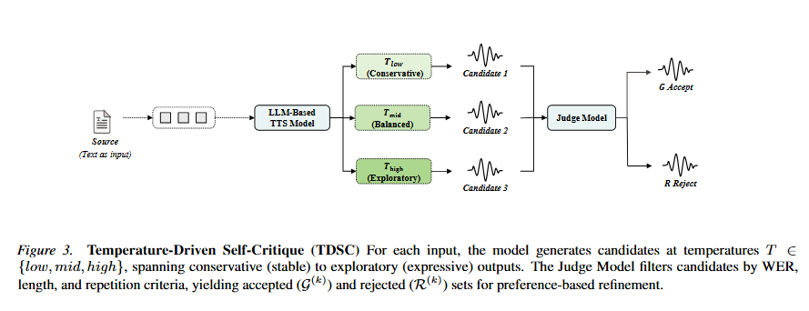

# SE-Bridge-TTS

<p align="center">
  <strong>Bridging the Stability-Expressivity Gap</strong><br>
  <span>Synthetic Data Scaling and Preference Alignment for Low-Resource Spoken Language Models</span><br>
  <span>ICML 2026</span>
</p>

<p align="center">
  <a href="https://piedpiperg.github.io/SE-Bridge-TTS/">
    
  </a>
  <a href="https://arxiv.org/abs/2605.27383">
    
  </a>
  <a href="https://huggingface.co/isabeth/SE-Bridge-TTS">
    
  </a>
  <a href="https://github.com/piedpiperG/SE-Bridge-TTS">
    
  </a>
</p>

SE-Bridge-TTS is a low-resource Thai and Lao speech synthesis project. It studies a practical failure mode in spoken language models: synthetic data improves pronunciation stability, but too much flat synthetic speech erodes prosody and speaker expressivity. The release provides public Thai and Lao CosyVoice2-compatible checkpoints on Hugging Face.

## What This Work Does

- **Thai:** DGSA recovers expressive speech at high synthetic-data ratios while preserving intelligibility and speaker identity.
- **Lao:** TDSC builds a pure-synthetic self-improvement loop, enabling Lao TTS and zero-shot voice cloning without authentic target-language recordings.
- **Open release:** public checkpoints, audio demos, project page, paper, and a Hugging Face model card with inference guidance.

## Methods

### DGSA: Disentanglement-Guided Self-Alignment

<p align="center">
  
</p>

DGSA uses the prosody-timbre separation in flow-matching SLMs to build preference pairs that reward stable, expressive speech without collapsing speaker identity.

### TDSC: Temperature-Driven Self-Critique

<p align="center">
  
</p>

TDSC samples candidates across conservative-to-expressive temperatures, filters them with automatic quality checks, and iteratively improves low-resource synthesis when real target-language speech is unavailable.

## Main Results

Lower WER is better. Higher SIM, NMOS, and SMOS are better.

| Task | Language | SE-Bridge-TTS | Strong comparison |
| --- | --- | --- | --- |
| Standard TTS | Thai | DGSA: **38.9 WER**, **4.51 NMOS** | ElevenLabs-v3: 40.6 WER / 4.21 NMOS; Azure: 36.5 WER / 4.01 NMOS |
| Standard TTS | Lao | TDSC: **29.8 WER**, **4.53 NMOS** | Gemini Flash: 34.2 WER / 4.12 NMOS; MMS-TTS: 44.8 WER / 3.52 NMOS |
| Zero-shot voice cloning | Thai | DGSA: **38.9 WER**, **0.84 SIM**, **4.42 NMOS**, **4.51 SMOS** | ElevenLabs-v3: 42.3 WER / 0.78 SIM / 4.21 NMOS / 4.23 SMOS |
| Zero-shot voice cloning | Lao | TDSC: **29.8 WER**, **0.81 SIM**, **3.94 NMOS**, **4.32 SMOS** | Other tested systems: not supported |

Selected demos are available on the [project page](https://piedpiperg.github.io/SE-Bridge-TTS/#audio-demo), including [Thai standard TTS](assets/audio/benchmarks/thai/ours-dgsa-sample1.wav), [Lao standard TTS](assets/audio/benchmarks/lao/ours-tdsc-sample1.wav), [Thai cloning](assets/audio/cloning/thai/ours-th-9804.wav), and [Lao cloning](assets/audio/cloning/lao/ours-common-voice-lo.wav).

## Use the Weights

The release checkpoints are hosted at:

https://huggingface.co/isabeth/SE-Bridge-TTS

For inference:

1. Open the Hugging Face model card above.
2. Download `thai_tts.pt` or `lao_tts.pt` from the model repository.
3. Follow the CosyVoice2 loading example in the model card.

| File | Language | Recommended use |
| --- | --- | --- |
| `thai_tts.pt` | Thai | CosyVoice2 zero-shot TTS and voice cloning |
| `lao_tts.pt` | Lao | CosyVoice2 cross-lingual or zero-shot prompting |

This GitHub repository is intentionally lightweight: it hosts the project page, audio demos, paper links, and release pointers; the runnable checkpoint package lives on Hugging Face.

## Links

| Resource | Link |
| --- | --- |
| Project page and audio browser | https://piedpiperg.github.io/SE-Bridge-TTS/ |
| Paper | https://arxiv.org/abs/2605.27383 |
| Weights and inference notes | https://huggingface.co/isabeth/SE-Bridge-TTS |
| Demo metadata | `assets/data/demo-data.json` |

## Citation

```bibtex
@inproceedings{geng2026bridging,
  title = {Bridging the Stability-Expressivity Gap: Synthetic Data Scaling and Preference Alignment for Low-Resource Spoken Language Models},
  author = {Geng, Yizhong and Li, Yanliang and Yang, Jinghan and Jiang, Tianhan and An, Boxun and Li, Ya and Shen, Xiaoyu},
  booktitle = {Proceedings of the 43rd International Conference on Machine Learning},
  year = {2026}
}
```
